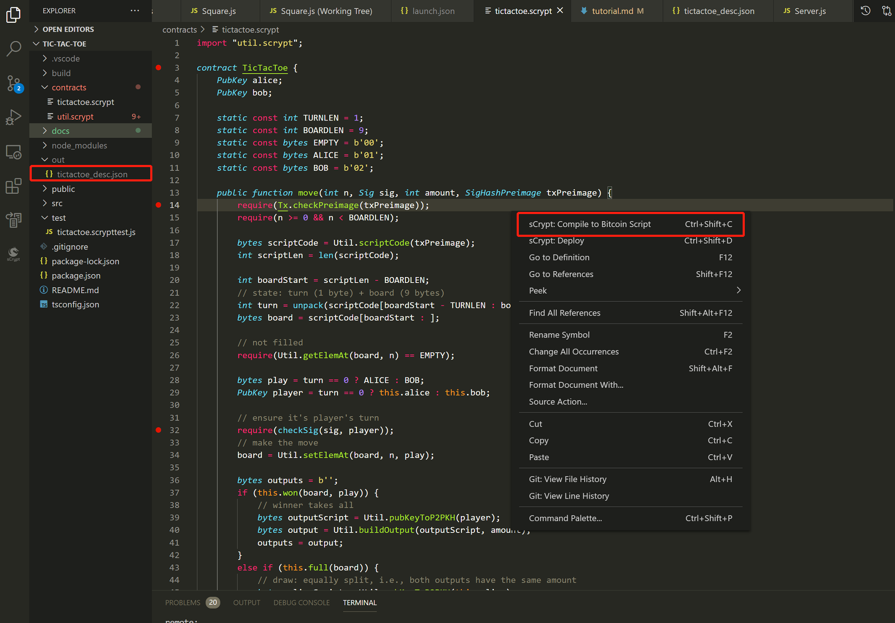

# sCrypt Dapp 教程

在我们的[博客](https://blog.csdn.net/freedomhero)中，介绍了如何使用 sCrypt 来编写比特币智能合约。但是作为刚入门的开发者，你可能对如何使用 sCrypt 来构建 Dapp 更加感兴趣。接下来我们将教大家如何使用 sCrypt 一步一步地构建一个井字棋 Dapp.

该应用程序非常简单，它所做的就是使用两个玩家(分别是 Alice 和 Bob)的公钥哈希，初始化合约，各自下注相同的金额锁定到合约中，只有赢得那个人可以取走合约里面的钱，如果最后没有人赢，则两个玩家各自可以取走一半的钱。目标不仅是对应用程序进行编码，主要是学习如何对其进行编译，测试，部署和交互的过程。

## 搭建开发环境

1. 安装 sCrypt IDE，见 [sCrypt 开发工具篇 - Visual Studio Code 插件](https://blog.csdn.net/freedomhero/article/details/107127341)
1. 安装 nodejs, _version >= 12_

搭建开发环境非常简单方便，接下来我们用 [create-react-app](https://github.com/facebook/create-react-app) 来创建一个 react app， 执行 ` npx create-react-app tic-tac-toe`。然后用 vscode 打开我们刚刚创建的代码工程，并在根目录下创建一个`contracts` 目录，用来存放我们的合约代码，当然你也可以命名成其它名字。

## 使用 sCrypt 编写 tic-tac-toe 合约

我们将使用 sCrypt 编程语言来编写一个名为 TicTacToe 的合约，如果您还不了解 sCrypt 编程语言，可以查看我们的入门教程[高级语言 sCrypt 简介](https://blog.csdn.net/freedomhero/article/details/107104952), 下面是我们的合约代码：

```javascript

import "util.scrypt";

contract TicTacToe {
    PubKey alice;
    PubKey bob;

    static const int TURNLEN = 1;
    static const int BOARDLEN = 9;
    static const bytes EMPTY = b'00';
    static const bytes ALICE = b'01';
    static const bytes BOB = b'02';

    public function move(int n, Sig sig, int amount, SigHashPreimage txPreimage) {
        require(Tx.checkPreimage(txPreimage));
        require(n >= 0 && n < BOARDLEN);

        bytes scriptCode = Util.scriptCode(txPreimage);
        int scriptLen = len(scriptCode);

        int boardStart = scriptLen - BOARDLEN;
        // state: turn (1 byte) + board (9 bytes)
        int turn = unpack(scriptCode[boardStart - TURNLEN : boardStart]);
        bytes board = scriptCode[boardStart : ];

        // not filled
        require(Util.getElemAt(board, n) == EMPTY);

        bytes play = turn == 0 ? ALICE : BOB;
        PubKey player = turn == 0 ? this.alice : this.bob;

        // ensure it's player's turn
        require(checkSig(sig, player));
        // make the move
        board = Util.setElemAt(board, n, play);

        bytes outputs = b'';
        if (this.won(board, play)) {
            // winner takes all
            bytes outputScript = Util.pubKeyToP2PKH(player);
            bytes output = Util.buildOutput(outputScript, amount);
            outputs = output;
        }
        else if (this.full(board)) {
            // draw: equally split, i.e., both outputs have the same amount
            bytes aliceScript = Util.pubKeyToP2PKH(this.alice);
            bytes aliceOutput = Util.buildOutput(aliceScript, amount);

            bytes bobScript = Util.pubKeyToP2PKH(this.bob);
            bytes bobOutput = Util.buildOutput(bobScript, amount);

            outputs = aliceOutput + bobOutput;
        } else {
            // update state: next turn & next board
            bytes scriptCode_ = scriptCode[ : scriptLen - BOARDLEN - TURNLEN] + num2bin(1 - turn, TURNLEN) + board;
            bytes output = Util.buildOutput(scriptCode_, amount);
            outputs = output;
        }

        require(hash256(outputs) == Util.hashOutputs(txPreimage));
    }

    // does play win after current move?
    function won(bytes board, bytes play) : bool {
        // three in a row, a column, or a diagnoal
        int[8][3] lines = [
        [0, 1, 2],
        [3, 4, 5],
        [6, 7, 8],
        [0, 3, 6],
        [1, 4, 7],
        [2, 5, 8],
        [0, 4, 8],
        [2, 4, 6]
        ];

        bool anyLine = false;
        loop (8) : i {
            bool line = true;
            loop (3) : j {
                line = line && Util.getElemAt(board, lines[i][j]) == play;
            }

            anyLine = anyLine || line;
        }

        return anyLine;
    }

    // is board full?
    function full(bytes board) : bool {
        bool full = true;

        loop (BOARDLEN) : i {
            full = full && Util.getElemAt(board, i) != EMPTY;
        }

        return full;
    }
}

```

合约中使用的`util.scrypt` 是我们的常用工具库，可以在我们的[boilerplate](https://github.com/sCrypt-Inc/boilerplate) 工程中找到，这里只是把他简单的拷贝过来。该合约有两个成员变量，分别是 alice 和 bob 的 PubKey，在构造合约的时候需要初始化他们， 主要有两个作用：

1. 在合约中检查合约的调用者是否预期的玩家
1. 游戏结束时将合约的赌注转移到 PubKey 对应的地址

合约的状态(state)由两个变量组成：

1. `turn`: 轮流顺序, 0 表示轮到 Alice 下棋， 1 表示轮到 Bob 下棋, 长度为 1 byte
1. `board`: 棋盘，记录棋盘当前的状态，长度为 9 byte

合约中有 3 个函数：

1. `move` 是 唯一的 _public_ 函数，合约在区块链上的状态变化，是通过调用此函数触发的。
1. `won` 检查当前棋盘状态，有没有玩家已经赢得比赛，如果有人已经赢得比赛，那就将合约锁定的币转移到赢家对应的 PubKey 的地址
1. `full` 检查当前棋盘 9 个格子是否都走过了，如果已经都走过了，也没人赢，那相当于平局，则两两个人平分赌注

完成合约的编写后，我们可以右键编译合约，将会看到输出 `tictactoe_desc.json` 到`out`中， Dapp 将使用此文件来部署合约到区块链中，如下图：



## 测试合约

测试合约需要用到用于集成合约的`scryptlib`库以及测试框架`mocha`，执行以下命令来安装

`npm i scryptlib`

`npm i chai mocha --save-dev`

测试代码见 [tictactoe.scrypttest.js](../contracts/tictactoe.scrypttest.js)

至此，我们完成了合约代码的编写和测试。

## 部署合约

首先我们按照 react 官方的 [教程](https://reactjs.org/tutorial/tutorial.html)， 搭建一个没有集成合约的 tic-tac-toe 游戏，可以地将 [react-tutorial-tic-tac-toe](https://github.com/guar47/react-tutorial-tic-tac-toe) 的几个文件拷贝过来放到 `src` 目录中，游戏就能跑起来了。

接下来，我们将合约编译之后的 `tictactoe_desc.json` 拷贝到 `public` 目录中，以便我们的能从前端页面加载到合约的描述文件。

由于现在没有支持非标脚本的钱包可以用，我们需要先实现一个测试网的钱包。我们将钱包的接口定义在[wallet.ts](../src/web3/wallet.ts) 中, 包括以下接口

```typescript

  //Dapp use this api to connect to the wallet.
  abstract requestAccount(name: string, permissions: string[]): Promise<Account>;

  //get wallet balance
  abstract getbalance(): Promise<number>;

  //sign raw transaction, returns unlockscript of the p2pkh input if success
  abstract signRawTransaction(tx: Tx, inputIndex: number, sigHashType: SignType
  ): Promise<string>;

  //get signature for special input
  abstract getSignature(tx: Tx, inputIndex: number, sigHashType: SignType
  ): Promise<string>;

  //send raw transaction, returns transaction hash if success
  abstract sendRawTransaction(rawTx: string): Promise<string>;

  //returns array of unspent transaction outputs, which total amount is more than the minAmount argument.
  abstract listUnspent(minAmount: number, options?: {
    purpose?: string
  }): Promise<UTXO[]>;

  //returns a new Bitcoin address, for receiving change.
  abstract getRawChangeAddress(options?: {
    purpose?: string
  }): Promise<string>;

  //returns a public key
  abstract getPublicKey(options?: {
    purpose?: string
  }): Promise<string>;


```

[localwallet.ts](../src/web3/localwallet.ts) 则是我们的具体实现。

> 注意：web3 目录下的代码是用 typescript 编写的，编译之前需要先安装 typescript， 同时，需要安装 qrcode.react 和 axios

我们创建 wallet.js react 组件，并在页面中将这个组件绘制出来，并往钱包充点测试币，就能看到如下：


接下来需要设计 Alice 和 Bob 下注的流程：

1.  Alice 发起游戏，并提供他的公钥 `alicePubKey`

    ```javascript
    async function startBet(amount) => {
         ...

         let alicePubKey = await web3.wallet.getPublicKey();

         server.createGame({
             "amount": amount,
             "tx": {
             inputs: [],
             outputs: []
             },
             "name": "tic-tac-toe",
             "alicePubKey": alicePubKey,
             "bobPubKey": "",
             "creator": "alice",
             "player": "",
             "date": new Date()
         })
         ...
     }
    ```

1.  Bob 通过 Alice 提供的连接加入游戏，Bob 得到 Alice publickKey 后，他就能构建合约了，他通过 `fetchContract` 加载合约的描述文件，并使用两个人的 publickey 初始化合约：

    ```javascript
    async function fetchContract(alicePubKey, bobPubKey) {
      if (contractInstance === null && alicePubKey && bobPubKey) {
        let { contractClass: TictactoeContractClass } = await web3.loadContract(
          "/tic-tac-toe/tictactoe_desc.json"
        );

        let c = newCall(TictactoeContractClass, [
          new PubKey(toHex(alicePubKey)),
          new PubKey(toHex(bobPubKey)),
        ]);
        c.setDataPart("00000000000000000000");
        updateContractInstance(c);
        return c;
      }
      return contractInstance;
    }
    ```

    接下来 Bob 构建下注的交易，并通过 saveGame 将自己的 PubKey 和构建好的未签名交易发送给 Alice

    ```javascript
    async function bobJoin(game) {
     let bobPubKey = await web3.wallet.getPublicKey();

     ...

     game = Object.assign(game, {
       bobPubKey: bobPubKey,
       player: "Bob",
     });

     let c = await fetchContract(game.alicePubKey, game.bobPubKey);

     if (c != null) {
       web3
         .buildUnsignDeployTx(c, game.amount)
         .then((tx) => {
           tx.outputs[0].satoshis = game.amount * 2;
           server.saveGame(
             Object.assign(game, {
               tx: tx,
             }),
             "JoinGame"
           );
         })
         .catch((e) => {
             ...
         });
     }
    }
    ```

    注意这里用的是 `buildUnsignDeployTx`， 这是时候 Bob 还不能进行签名，因为 Alice 还没有提供他的下注。下面是 Bob 构建下注交易的实现，我们可以看到 Bob 调用钱包的 `listUnspent` 接口向钱包索要一个可用于下注的 utxo 和一个用于找零的地址，构建了一个包含一个 Input、两个 Output 的未签名交易。

    ```typescript
     static async buildUnsignDeployTx(contract: AbstractContract, amountInContract: number): Promise<Tx> {
        const changeAddress = await web3.wallet.getRawChangeAddress();
            return web3.wallet.listUnspent(amountInContract + FEE, {
            purpose: 'change'
        }).then(async (utxos: UTXO[]) => {
            if (utxos.length === 0) {
                throw new Error('no utxos');
            }

            const tx: Tx = {
                inputs: [],
                outputs: []
            };
            const input: Input = {
                utxo: utxos[0],
                sequence: 0,
                script: ''
            };

            tx.inputs.push(input);

            tx.outputs.push({
                script: contract.lockingScript.toHex(),
                satoshis: amountInContract
            });

            const changeAmount = utxos[0].satoshis - amountInContract - FEE;
            tx.outputs.push({
                script: bsv.Script.buildPublicKeyHashOut(changeAddress).toHex(),
                satoshis: changeAmount
            });

            return tx;
        });
     }
    ```

1.  Alice 收到 Bob 加入游戏的事件以及 Bob 提供的未签名的下注交易后，同样调用自己钱包的 `listUnspent` 接口向钱包索要一个可用于下注的 utxo 和一个用于找零的地址， 向 Bob 提供的未签名交易添加了一个用于下注的 Input 和一个用于找零的 Output, 这个时候 Alice 可以开始对交易进行签名了,同时他也可以用 `fetchContract` 初始化合约了。之后她将签名好的交易发送给 Bob.

    ```javascript
    const onBobJoin = async (game) => {

        ...

        fetchContract(game.alicePubKey, game.bobPubKey)

        let tx = await web3.appendPayInputAndSign(game.tx, game.amount);
        game.tx = tx;

        server.saveGame(game, 'AliceSign');

        ...

    }
    ```

1.  Bob 收到 Alice 签名好的交易，也可以对交易进行签名了。签名完成后，他调用钱包的 `sendTx` 接口，将交易发生到区块链中。

    ```javascript
    const onAliceSign = async (game) => {
      //after Alice sign, Bob sign

      let sig = await web3.wallet.signRawTransaction(game.tx, 0, SignType.ALL);
      game.tx.inputs[0].script = sig;
      web3.sendTx(game.tx).then((txid) => {
        game.lastUtxo = {
          txHash: txid,
          outputIndex: 0,
          satoshis: game.tx.outputs[0].satoshis,
          script: game.tx.outputs[0].script,
        };

        game.deploy = txid;

        server.saveGame(game, "deployed");
        updateStart(true);
      });
    };
    ```

到这里我们的下注交易完成了，也就是合约部署到链上了。Alice 和 Bob 都通过 `fetchContract` 持有了一个合约实例。

## 调用合约

接下来就是开始下棋了，每下一步棋，就是对合约的一次调用，并触发合约状态的改变。调用合约需要构建一个符合合约规则的交易。首先需要计算合约的新状态,同时，我们可以在 Dapp 通过棋盘状态推演出来谁输谁赢，这样就能根据结果来构建交易的输出。下面就是推演结果和构建调用合约交易的代码。

```javascript
let newState =
  (!this.state.xIsNext ? "00" : "01") +
  squares
    .map((square) => {
      if (square && square.label === "X") {
        return "01";
      } else if (square && square.label === "O") {
        return "02";
      } else {
        return "00";
      }
    })
    .join("");

let newLockingScript = "";
let winner = calculateWinner(squares).winner;
const FEE = 3000;
let outputs = [];
let amount = this.props.game.lastUtxo.satoshis - FEE;
if (winner) {
  // winner is current player

  let address = await web3.wallet.getRawChangeAddress();

  newLockingScript = bsv.Script.buildPublicKeyHashOut(address).toHex();

  outputs.push({
    satoshis: amount,
    script: newLockingScript,
  });
} else if (history.length >= 9) {
  const aliceAddress = new bsv.PublicKey(this.props.game.alicePubKey, {
    network: bsv.Networks.testnet,
  });
  const bobAddress = new bsv.PublicKey(this.props.game.bobPubKey, {
    network: bsv.Networks.testnet,
  });

  //no body win
  const aliceLockingScript = bsv.Script.buildPublicKeyHashOut(
    aliceAddress.toAddress(bsv.Networks.testnet)
  ).toHex();
  const bobLockingScript = bsv.Script.buildPublicKeyHashOut(
    bobAddress.toAddress(bsv.Networks.testnet)
  ).toHex();
  amount = (this.props.game.lastUtxo.satoshis - FEE) / 2;

  outputs.push({
    satoshis: amount,
    script: aliceLockingScript,
  });

  outputs.push({
    satoshis: amount,
    script: bobLockingScript,
  });
} else {
  //next
  newLockingScript = [
    this.props.contractInstance.codePart.toHex(),
    bsv.Script.fromASM(newState).toHex(),
  ].join("");
  outputs.push({
    satoshis: amount,
    script: newLockingScript,
  });
}

// build a transtion

let tx = {
  inputs: [
    {
      utxo: this.props.game.lastUtxo,
      sequence: 0,
      script: "",
    },
  ],
  outputs: outputs,
};
```

上面 Input 对应的 `script` 默认是空的，也就是构建的交易并没包含解锁脚本，我们需要计算并填充解锁脚本，才能构成一个完整的交易。 我们知道 sCrypt public 方法的参数就是对应的解锁脚本。`TicTacToe` 合约的 move 函数有 4 个参数：

1. `n` 落子在棋盘的什么位置
1. `amount` 合约花费后剩下的余额
1. `txPreimage` 交易原象， 如果您对这个参数不了解，可以查看[深入学习比特币脚本之 OP_PUSH_TX](https://blog.csdn.net/freedomhero/article/details/107306604)
1. `sig` 对交易的签名

前面 2 个参我们都可以在 Dapp 端计算， `txPreimage` 由于未签名的交易模板已经构建好，我们也可以直接在 Dapp 端直接调用 `getPreimage` 方法计算。
`sig` 的计算涉及到私钥，我需要使用钱包的 `getSignature` 方法。

当 4 个解锁参数我们都计算好之后，我们可以调用合约实例的 `move` 方法来计算解锁脚本 `unlockScript`

```javascript
    ...

    let unlockScript = this.props.contractInstance.move(i, new Sig(toHex(sig)), amount, preimage).toHex();
    tx.inputs[0].script = unlockScript; // 填充解锁脚本后，交易才算是构建完整了

    ...
```

接下来通过 `web3.sendTx` 调用钱包的 `sendRawTransaction` 将交易发送到区块链上。发送完成后，如果成功被区块链接受，则说明玩家落子成功，如果失败，我们可以看到对应的错误提示，比如交易费用不足。我们将合约对应的新的 Output 保存到 lastUtxo, 以便下次调用合约时候可以直接使用。

> 注意，由于这里我们使用的 localstorage 来模拟服务器通信，所以 alice 更新 lastUtxo 后，bob 也就能获取到对应的最新的 lastUtxo，在实际的生产环境中，合约的最新的 utxo 需要通过其它方法来获取。

至此，我们完成了 TicTacToe 小游戏下棋动作和合约调用的绑定，玩家的每个下棋动作，都产生一个区块链上对应的 transaction 与之对应。
