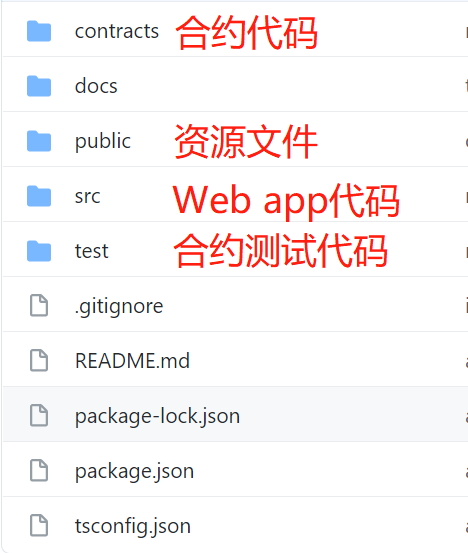
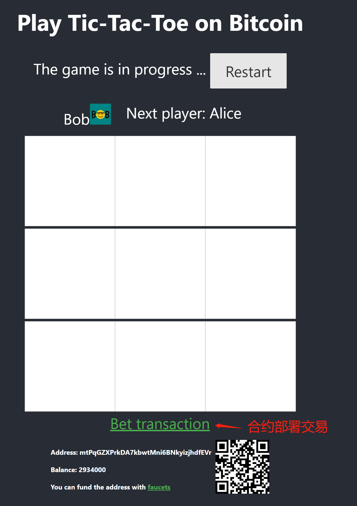

# sCrypt dApp 教程

在我们的[博客](https://blog.csdn.net/freedomhero)中，介绍了如何使用 sCrypt 来编写比特币智能合约。但是作为刚入门的开发者，你可能对如何使用 sCrypt 来构建 dApp 更加感兴趣。接下来我们将教大家如何使用 sCrypt 一步一步地构建一个井字棋 dApp.

该应用程序非常简单，它所做的就是使用两个玩家(分别是 Alice 和 Bob)的公钥哈希，初始化合约，各自下注相同的金额锁定到合约中，只有赢得那个人可以取走合约里面的钱，如果最后没有人赢，则两个玩家各自可以取走一半的钱。目标不仅是对应用程序进行编码，主要是学习如何对其进行编译，测试，部署和交互的过程。

我们将逐步完成构建全栈去中心化应用程序的整个过程，包括:

1. 编写合约
1. 测试合约
1. 将 web app 集成合约

## 搭建开发环境

1. 安装 sCrypt IDE，见 [sCrypt 开发工具篇 - Visual Studio Code 插件](https://blog.csdn.net/freedomhero/article/details/107127341)
1. 安装 nodejs, _version >= 12_
1. 安装 Typescript

搭建开发环境非常简单方便，接下来我们用 [create-react-app](https://github.com/facebook/create-react-app) 来创建一个 react app， 执行 ` npx create-react-app tic-tac-toe`。然后用 vscode 打开我们刚刚创建的代码工程，并在根目录下创建一个`contracts` 目录，用来存放我们的合约代码，创建一个 `test` 目录，用来存放合约的测试代码。你将看到以下目录结构。



## 使用 sCrypt 编写 tic-tac-toe 合约

我们将使用 sCrypt 编程语言来编写一个名为 TicTacToe 的合约， TicTacToe 合约主要实现原理是将游戏的状态存储在合约中，这在之前的[文章](https://xiaohuiliu.medium.com/tic-tac-toe-on-bitcoin-sv-5acdf5bd676d)已经详细介绍过了

游戏状态由以下组成：

1. `turn`: 轮到谁下棋, 0 表示轮到 Alice， 1 表示轮到 Bob, 长度为 1 byte
1. `board`: 记录棋盘当前的状态，每个字节代表棋盘的一个位置，0 表示空，1 表示 ALICE，2 表示 BOB，长度为 9 byte

```javascript

import "util.scrypt";

contract TicTacToe {
    PubKey alice;
    PubKey bob;

    static const int TURNLEN = 1;
    static const int BOARDLEN = 9;
    static const bytes EMPTY = b'00';
    static const bytes ALICE = b'01';
    static const bytes BOB = b'02';

    public function move(int n, Sig sig, int amount, SigHashPreimage txPreimage) {
        require(Tx.checkPreimage(txPreimage));
        require(n >= 0 && n < BOARDLEN);

        bytes scriptCode = Util.scriptCode(txPreimage);
        int scriptLen = len(scriptCode);

        int boardStart = scriptLen - BOARDLEN;
        // state: turn (1 byte) + board (9 bytes)
        int turn = unpack(scriptCode[boardStart - TURNLEN : boardStart]);
        bytes board = scriptCode[boardStart : ];

        // not filled
        require(Util.getElemAt(board, n) == EMPTY);

        bytes play = turn == 0 ? ALICE : BOB;
        PubKey player = turn == 0 ? this.alice : this.bob;

        // ensure it's player's turn
        require(checkSig(sig, player));
        // make the move
        board = Util.setElemAt(board, n, play);

        bytes outputs = b'';
        if (this.won(board, play)) {
            // winner takes all
            bytes outputScript = Util.pubKeyToP2PKH(player);
            bytes output = Util.buildOutput(outputScript, amount);
            outputs = output;
        }
        else if (this.full(board)) {
            // draw: equally split, i.e., both outputs have the same amount
            bytes aliceScript = Util.pubKeyToP2PKH(this.alice);
            bytes aliceOutput = Util.buildOutput(aliceScript, amount);

            bytes bobScript = Util.pubKeyToP2PKH(this.bob);
            bytes bobOutput = Util.buildOutput(bobScript, amount);

            outputs = aliceOutput + bobOutput;
        } else {
            // update state: next turn & next board
            bytes scriptCode_ = scriptCode[ : scriptLen - BOARDLEN - TURNLEN] + num2bin(1 - turn, TURNLEN) + board;
            bytes output = Util.buildOutput(scriptCode_, amount);
            outputs = output;
        }

        require(hash256(outputs) == Util.hashOutputs(txPreimage));
    }

    // does play win after current move?
    function won(bytes board, bytes play) : bool {
        // three in a row, a column, or a diagnoal
        int[8][3] lines = [
        [0, 1, 2],
        [3, 4, 5],
        [6, 7, 8],
        [0, 3, 6],
        [1, 4, 7],
        [2, 5, 8],
        [0, 4, 8],
        [2, 4, 6]
        ];

        bool anyLine = false;
        loop (8) : i {
            bool line = true;
            loop (3) : j {
                line = line && Util.getElemAt(board, lines[i][j]) == play;
            }

            anyLine = anyLine || line;
        }

        return anyLine;
    }

    // is board full?
    function full(bytes board) : bool {
        bool full = true;

        loop (BOARDLEN) : i {
            full = full && Util.getElemAt(board, i) != EMPTY;
        }

        return full;
    }
}

```

合约中有 3 个函数：

1. `move` 爱丽丝（Alice）和鲍勃（Bob）各自将 X 个比特币锁定在包含上述合同的一个 UTXO 中。 接下来，他们通过调用公共函数`move()`交替玩游戏
1. `won` 检查是否有玩家已经赢得比赛，他将能取走所有合约锁定的赌注
1. `full` 如果棋盘，没人赢得比赛，则两个人平分赌注

## 测试合约

接下来我们用 Javascript 编写合约的单元测试，以确保合约在上线部署之前能够按预期工作。 通过[sCrypt 测试框架](https://github.com/sCrypt-Inc/boilerplate#how-to-write-test-for-an-scrypt-contract)，我们可以模拟调用 `move()` 并断言游戏状态

```javascript

const Tictactoe = buildContractClass(runCompile('tictactoe.scrypt'));

game = new Tictactoe(new PubKey(toHex(publicKey1)), new PubKey(toHex(publicKey2)));

let state = new Bytes('00000000000000000000').toASM();
game.setDataPart(state)

describe('Test sCrypt contract Tictactoe In Javascript', () => {
  let result, preimage, sig, prevLockingScript


  it('Alice places an X at 0-th cell', () => {

    prevLockingScript = game.lockingScript.toASM();

    let newState = new Bytes('01010000000000000000').toASM();

    const tx = newTx();
    const newLockingScript = [game.codePart.toASM(), newState].join(' ');


    tx.addOutput(new bsv.Transaction.Output({
      script: bsv.Script.fromASM(newLockingScript),
      satoshis: 10000
    }))

    preimage = getPreimage(tx, prevLockingScript, inputSatoshis);

    sig = signTx(tx, privateKey1, prevLockingScript, inputSatoshis)

    const context = { tx, inputIndex, inputSatoshis }

    result = game.move(0, new Sig(toHex(sig)), 10000, preimage).verify(context)
    expect(result.success, result.error).to.be.true;

    game.setDataPart(newState)

  });
}

```

## 集成合约

### 1. 部署合约

我们将复用 [官方 React 教程](https://reactjs.org/tutorial/tutorial.html) 中现有的 [tic-tac-toe](https://github.com/guar47/react-tutorial-tic-tac-toe) 项目。如果您有前端开发的经验，这应该看起来很熟悉。我们将专注于集成 dApp 的智能合约部分。对于与比特币区块链的所有交互，我们使用 [whatsonchain](https://developers.whatsonchain.com/#introduction) 提供的 API。

1. 通过右键单击 **编译** 来编译我们的合约。将会输出 `tictactoe_desc.json`，这包含有关我们合约的所有内容，将其拷贝到 `public` 目录中，以便我们的能从前端页面加载到该文件。
   

1. 我们需要先实现一个测试网的钱包。我们将钱包的接口定义在[wallet.ts](../src/web3/wallet.ts) 中, 包括以下接口:

   ```typescript

     //Dapp use this api to connect to the wallet.
     abstract requestAccount(name: string, permissions: string[]): Promise<Account>;

     //get wallet balance
     abstract getbalance(): Promise<number>;

     //sign raw transaction, returns unlockscript of the p2pkh input if success
     abstract signRawTransaction(tx: Tx, inputIndex: number, sigHashType: SignType
     ): Promise<string>;

     //get signature for special input
     abstract getSignature(tx: Tx, inputIndex: number, sigHashType: SignType
     ): Promise<string>;

     //send raw transaction, returns transaction hash if success
     abstract sendRawTransaction(rawTx: string): Promise<string>;

     //returns array of unspent transaction outputs, which total amount is more than the minAmount argument.
     abstract listUnspent(minAmount: number, options?: {
       purpose?: string
     }): Promise<UTXO[]>;

     //returns a new Bitcoin address, for receiving change.
     abstract getRawChangeAddress(options?: {
       purpose?: string
     }): Promise<string>;

     //returns a public key
     abstract getPublicKey(options?: {
       purpose?: string
     }): Promise<string>;

   ```

   [localwallet.ts](../src/web3/localwallet.ts) 则是我们的具体实现。

   我们创建 wallet.js react 组件，并在页面中绘制出来

   

   这样 Bob 和 Alice 就能往 dApp 充比特币了。

1. 资金准备就绪后，就能使用步骤 1 中的 `tictactoe_desc.json` 以及 Alice 和 Bob 的公钥来实例化合约了。

   ```javascript
   async function fetchContract(alicePubKey, bobPubKey) {
     let { contractClass: TictactoeContractClass } = await web3.loadContract(
       "/tic-tac-toe/tictactoe_desc.json"
     );

     let instance = newCall(TictactoeContractClass, [
       new PubKey(toHex(alicePubKey)),
       new PubKey(toHex(bobPubKey)),
     ]);
     instance.setDataPart("00000000000000000000");
     updateContractInstance(instance);
     console.log("fetchContract successfully");
     return instance;
   }
   ```

1. 合约实例化后，可以通过合约实例来构建交易了，Alice 和 Bob 分别提供一个 Input，同时我们给他添加一个对应的 Output 用于找零，最后我们构建出来一个包含 2 个 Input 和 3 个 Output 的交易。

   ```javascript
    static async buildDeployTx(contract: AbstractContract, amountInContract: number, alicePrivateKey: string, bobPrivateKey: string): Promise<Tx> {

        let aliceWallet = new LocalWallet(NetWork.Testnet, alicePrivateKey);
        let bobWallet = new LocalWallet(NetWork.Testnet, bobPrivateKey);

        const aliceChangeAddress = await aliceWallet.getRawChangeAddress();
        const bobChangeAddress = await bobWallet.getRawChangeAddress();

        const tx: Tx = {
          inputs: [],
          outputs: []
        };

        tx.outputs.push({
          script: contract.lockingScript.toHex(),
          satoshis: amountInContract * 2
        });

        const minAmount = amountInContract + FEE;

        return aliceWallet.listUnspent(minAmount, {
          purpose: 'change'
        }).then(async (utxos: UTXO[]) => {

          if (utxos.length === 0) {
            throw new Error('no utxos');
          }

          //add input which using utxo from alice
          tx.inputs.push(
            {
              utxo: utxos[0],
              script: '',
              sequence: 0
            }
          );

          const changeAmount = utxos[0].satoshis - amountInContract - FEE;

          if (changeAmount <= 0) {
            throw new Error('fund is not enough');
          }

          //add alice change output

          tx.outputs.push(
            {
              script: bsv.Script.buildPublicKeyHashOut(aliceChangeAddress).toHex(),
              satoshis: changeAmount
            }
          );

          return tx;
        }).then(tx => {
          return bobWallet.listUnspent(minAmount, {
            purpose: 'change'
          }).then(async (utxos: UTXO[]) => {

            if (utxos.length === 0) {
              throw new Error('no utxos');
            }

            //add input which using utxo from bob
            tx.inputs.push(
              {
                utxo: utxos[0],
                script: '',
                sequence: 0
              }
            );

            const changeAmount = utxos[0].satoshis - amountInContract - FEE;

            if (changeAmount <= 0) {
              throw new Error('fund is not enough');
            }

            //add bob change output
            tx.outputs.push(
              {
                script: bsv.Script.buildPublicKeyHashOut(bobChangeAddress).toHex(),
                satoshis: changeAmount
              }
            );

            return tx;

          })
        }).then(tx => {
          //alice sign
          return aliceWallet.signRawTransaction(tx, 0, SignType.ALL).then(unlockscript => {
            tx.inputs[0].script = unlockscript;
            return tx;
          })
        }).then(tx => {
          //bob sign
          return bobWallet.signRawTransaction(tx, 1, SignType.ALL).then(unlockscript => {
            tx.inputs[1].script = unlockscript;
            return tx;
          })
        })
      }
   ```

1. 交易构建完成后，分别由 Alice 和 Bob 进行签名，然后广播，从而完成合约的部署。我们尝试运行 `npm start` ，并用浏览器打开[http://localhost:3000](http://localhost:3000), 尝试开始游戏，如果顺利，我们将会看到部署成功的交易，尝试打开浏览一下交易：

   

### 2. 调用合约

接下来就是开始下棋了，每下一步棋，就是对合约的一次调用，并触发合约状态的改变。调用合约需要构建一个符合合约规则的交易。首先需要计算合约的新状态,同时，我们可以在 dApp 通过棋盘状态推演出来谁输谁赢，这样就能根据结果来构建交易的输出。下面就是推演结果和构建调用合约交易的代码。

1. 计算合约的新状态

   ```javascript

     calculateNewState(squares) {
       return (!this.state.xIsNext ? '00' : '01') + squares.map(square => {

         if (square && square.label === 'X') {
           return '01'
         } else if (square && square.label === 'O') {
           return '02'
         } else {
           return '00';
         }
       }).join('');
     }

   ```

1. 构建调用合约的交易

   ```javascript

   async buildCallContractTx(i, newState, squares, history) {
       let newLockingScript = "";
       let winner = calculateWinner(squares).winner;
       const FEE = 3000;
       let outputs = [];
       let amount = this.props.game.lastUtxo.satoshis - FEE;
       if (winner) {
         // winner is current player

         let address = await web3.wallet.getRawChangeAddress();

         newLockingScript = bsv.Script.buildPublicKeyHashOut(address).toHex();

         outputs.push({
           satoshis: amount,
           script: newLockingScript
         })

       } else if (history.length >= 9) {

         const aliceAddress = new bsv.PublicKey(this.props.game.alicePubKey, {
           network: bsv.Networks.testnet
         });
         const bobAddress = new bsv.PublicKey(this.props.game.bobPubKey, {
           network: bsv.Networks.testnet
         });

         //no body win
         const aliceLockingScript = bsv.Script.buildPublicKeyHashOut(aliceAddress.toAddress(bsv.Networks.testnet)).toHex();
         const bobLockingScript = bsv.Script.buildPublicKeyHashOut(bobAddress.toAddress(bsv.Networks.testnet)).toHex();
         amount = (this.props.game.lastUtxo.satoshis - FEE) / 2;

         outputs.push({
           satoshis: amount,
           script: aliceLockingScript
         })

         outputs.push({
           satoshis: amount,
           script: bobLockingScript
         })

       } else {
         //next
         newLockingScript = [this.props.contractInstance.codePart.toHex(), bsv.Script.fromASM(newState).toHex()].join('');
         outputs.push({
           satoshis: amount,
           script: newLockingScript
         })
       }


       if (outputs[0].satoshis <= 0) {
         alert(`fund in contract is too low `)
         return undefined;
       }


       let tx = {
         inputs: [{
           utxo: this.props.game.lastUtxo,
           sequence: 0,
           script: ""
         }],
         outputs: outputs
       }

       let preimage = getPreimage(tx);

       let sig = await web3.wallet.getSignature(tx, 0, SignType.ALL, true);

       let unlockScript = this.props.contractInstance.move(i, new Sig(toHex(sig)), amount, preimage).toHex();

       tx.inputs[0].script = unlockScript;

       return tx;
     }

   ```

   上面 Input 对应的 `script` 默认是空的，也就是构建的交易并没包含解锁脚本，我们需要计算并填充解锁脚本，才能构成一个完整的交易。 我们知道 sCrypt 合约 的 `public` 方法的参数就是对应的解锁脚本。`TicTacToe` 合约的 move 函数有 4 个参数：

   1. `n` 棋盘位置
   1. `amount` 合约花费后剩下的余额
   1. `txPreimage` 交易原象， 如果您对这个参数不了解，可以查看[深入学习比特币脚本之 OP_PUSH_TX](https://blog.csdn.net/freedomhero/article/details/107306604)
   1. `sig` 对交易的签名

   前面 2 个参我们都可以在 dApp 端计算， `txPreimage` 由于未签名的交易模板已经构建好，我们也可以直接在 dApp 端直接调用 `getPreimage` 方法计算。`sig` 的计算涉及到私钥，我需要使用钱包的 `getSignature` 方法。

   当 4 个解锁参数我们都计算好之后，我们可以调用合约实例的 `move` 方法来组装解锁脚本得到 `unlockScript`

   ```javascript
       ...

       let unlockScript = this.props.contractInstance.move(i, new Sig(toHex(sig)), amount, preimage).toHex();
       tx.inputs[0].script = unlockScript; // 填充解锁脚本后，交易才算是构建完整了

       ...
   ```

1. 交易构建完成了，接下来通过 API 将交易广播到区块链上。同时我们更新合约最新的 UTXO, 以便下次调用合约时候可以直接使用。

   ```javascript
       web3.sendTx(tx).then(txid => {
          squares[i].tx = txid;
          squares[i].n = history.length;
          let gameState = {
            history: history.concat([
              {
                squares,
                currentLocation: getLocation(i),
                stepNumber: history.length,
              },
            ]),
            xIsNext: !this.state.xIsNext,
            currentStepNumber: history.length,
          };

          server.saveGame(Object.assign({}, this.props.game, {
            gameState: gameState,
            lastUtxo: {
              txHash: txid,
              outputIndex: 0,
              satoshis: tx.outputs[0].satoshis,
              script: tx.outputs[0].script
            }
          }), 'next')

          this.setState(gameState);

      }).catch(e => {
        ...
      })
   ```

   > 注意，由于这里我们使用的 localstorage 来模拟服务器通信，所以 alice 更新 UTXO 后，bob 也就能获取到对应的最新的 UTXO，在实际的生产环境中，合约的最新的 utxo 需要通过其它方法来获取。

至此，我们完成了 TicTacToe 小游戏下棋动作和合约调用的绑定，玩家的每个下棋动作，都产生一个区块链上对应的 transaction 与之对应。

## 总结

恭喜你！ 您刚刚在比特币上构建了第一个全栈 dApp 现在，您可以玩井字游戏或在比特币上构建您自己喜欢的游戏。现在是时候喝些香槟了，或者打开下方连接和小伙伴来一场比赛：

## [tic-tac-toe](https://scrypt.io/tic-tac-toe/)
